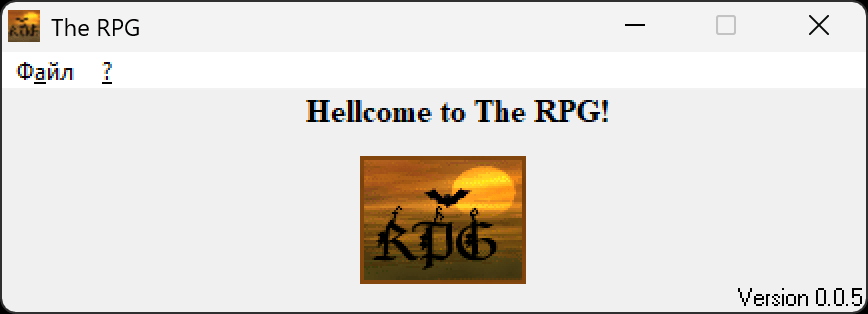

# The RPG

An upgraded, modernized version of The RPG game, originally written in C++ Builder 5 (circa 2001) and fully ported to Embarcadero C++ Builder 10.4 Sydney in August 2026.

**Original author:** Alexey Torkhov (Алексей Торхов).

### Screenshot of the main window (Version 0.0.5, created 2001-05-25), 
*Game logo created by Dmitry Nasonov, inspired by The Bat! mail client logo.*

📂 [All screenshots](screenshots/)

### License & Contributions

This project is licensed under the MIT License. Feel free to modify, distribute, and share both the source code and compiled binaries!